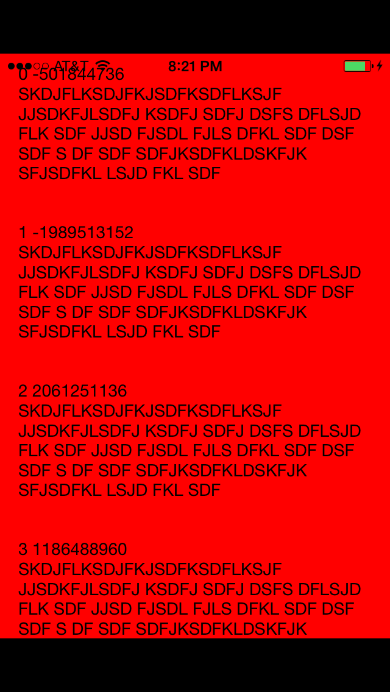
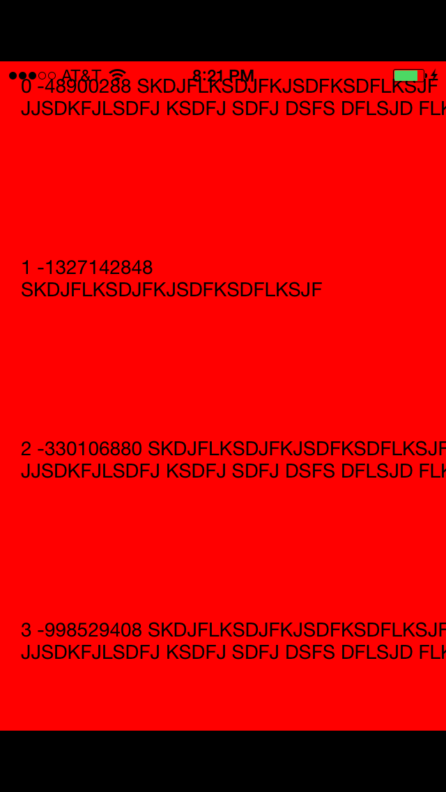
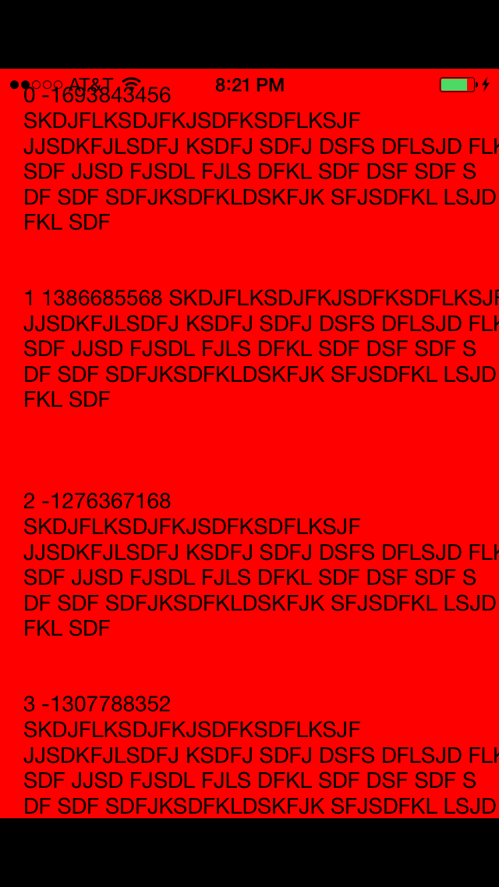

Example project that shows multi-line UILabels not behaving properly on iOS 7 when compiled with XCode 6 GM vs XCode 5.1.1

### XCode 5.1.1

### XCode 6 GM

Upon loading, the UILabel's are not properly sized.

After scrolling down and then back up to the top, the UILabel's are properly sized.

